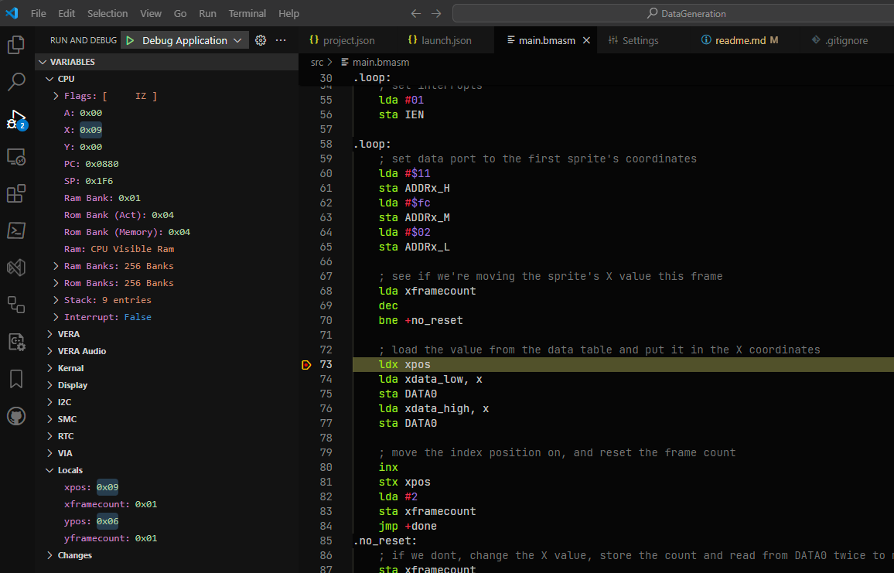

# Data Generation

This project demonstrates how BitMagic can be used to generate data, in this case a set of Sin tables.

The sin tables are created to move a 8x8 sprite around the screen.

The tables will be 256 entries long, so make it easier to index into.

For the X axis these will have to be between 0 and 320 - 8. We minus 8 so the sprite doesn't move off the screen. As the value range is above 255, these values will need to be 16bit.

To speed up reading the X axis values, these 16bit numbers will be split into a low and high value table.

The Y axis is simpler, values between 0 and 240 - 8 are required, so a 8bit table can be used.

## Sin Tables

The sin tables are generated at the end of the program.

There are two functions `GetYData()` and `GetXData()` which generate the 256 entry long values. The output of which is then passed into a library function `BM.Bytes`, `BM.LowBytes` or `BM.HighBytes` which creates a data block depending on the function.

Before these blocks are defined there is a `.align $100` to make sure that the start aligns to a memory block so when we use `lda ydata, x` there is no cycle penalty for going across a memory bank.

## Variables

After the data there are 4 variables defined using `.var`. This keyword allocates the space for the data type and initialises the value by storing it inside the file from the segment. `.var` cannot be used inside segments that do not produce a file, `.padvar` should be used instead but without the initial value.)

The benefit of defined a variable and its type (either using `.var`, `.constvar` or `.padvar`) is that these values are visible in the variables section within VSCode while debugging. They appear under the `Locals` entry near the bottom.

