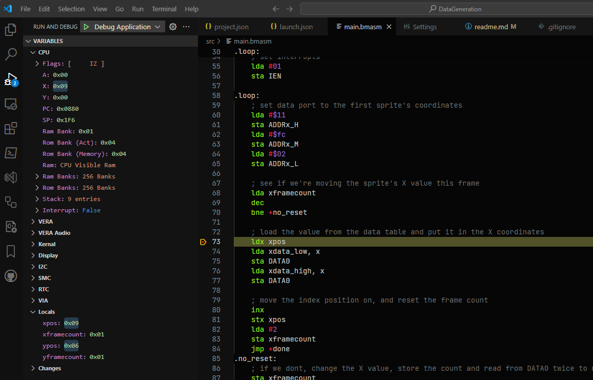

# Data Generation

Uses C# to generate sine tables at compile time, then uses them to move an 8x8 sprite around the screen. There's no data file and no table typed out by hand: the values are calculated while the program is built.

## How to run it

Open the folder in VSCode and press `F5`. A sprite moves around the screen in a loop.

## Planning the tables

Each table has 256 entries, so an 8 bit index wraps around on its own.

- **X** needs values from 0 to 320 - 8, so the sprite doesn't move off the screen. That's more than a byte, so the values are 16 bit. To keep reading them fast, they're split into a table of low bytes and a table of high bytes.
- **Y** needs values from 0 to 240 - 8, so a single table of bytes is enough.

## Generating the tables

Two C# methods at the end of `src/main.bmasm` return the values:

```bmasm
IEnumerable<byte> GetYData()
{
    // return data between 0 and 240-8.
    for(var i = 0; i < 256; i++)
    {
        yield return (byte)((Math.Sin((i / 256.0) * 2.0 * Math.PI) + 1) * (240-8) * 0.5);
    }
}
```

`GetXData()` is the same, but returns `ushort` values between 0 and 320 - 8.

Their output is passed to the BM library, which writes the data: `BM.Bytes` for the Y table, and `BM.LowBytes` and `BM.HighBytes` to split the X values.

```bmasm
.align $100
.ydata:
    BM.Bytes(GetYData());
.xdata_low:
    var xdata = GetXData().ToArray();
    BM.LowBytes(xdata);
.xdata_high:
    BM.HighBytes(xdata);
```

The `.align $100` puts the tables on a page boundary, so `lda ydata, x` never crosses a page and never takes the extra cycle.

## Variables

After the data, four variables are defined with `.var`:

```bmasm
.var byte xpos = 0
.var byte xframecount = 1
.var byte ypos = 0
.var byte yframecount = 1
```

`.var` reserves the space and stores the initial value in the output file, so it can only be used in a segment that writes a file. In one that doesn't, use `.padvar`, which reserves the space without a value.

Giving a variable a type (with `.var`, `.constvar` or `.padvar`) means the debugger knows how to show it. They appear under *Locals* in the variables view in VSCode while you're debugging.


