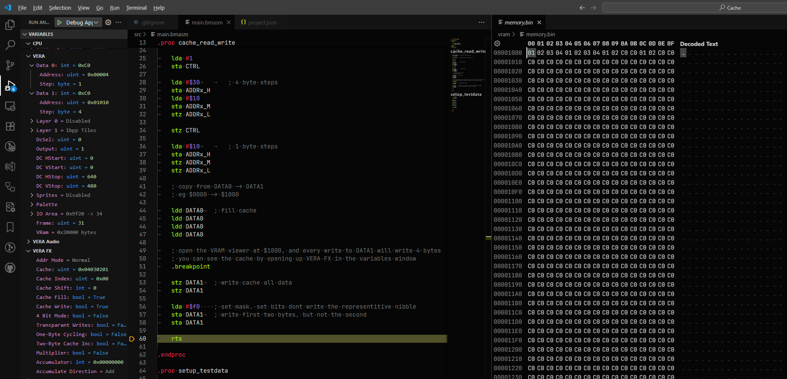

# FX Cache

How to use VERA's FX cache to copy VRAM four bytes at a time, including a write that masks some of the nibbles.

This page covers how the example sets the cache up. For the full behaviour of VERA FX, see the [VERA FX reference](https://github.com/X16Community/x16-docs/blob/master/X16%20Reference%20-%2010%20-%20VERA%20FX%20Reference.md).

## How to run it

Open the folder in VSCode and press `F5`. The program stops at a `.breakpoint` once the cache is filled. Open the VRAM viewer at `$1000` and expand *VERA FX* in the variables window to see the cache, then step over each write to `DATA1` and watch four bytes change at a time.

## Test data

`setup_testdata` writes `$01`, `$02`, `$03` and `$04` to VRAM at `$0000`, then points `DATA0` back at `$0000`.

## Setting up the cache

`cache_read_write` turns on cache fill and cache write in `FX_CTRL`, which is only visible when `DCSEL` is 2. Writing `0` to `FX_MULT` resets the cache's byte and nibble index.

```bmasm
    lda #2 << 1         ; DCSEL = 2
    sta CTRL

    lda #%01100000      ; cache fill and cache write
    sta FX_CTRL

    stz FX_MULT         ; byte and nibble index = 0
```

Then the two data ports are set up. `DATA1` writes to `$1000` with an increment of 4, as each cache write covers four bytes. `DATA0` reads from `$0000` with an increment of 1.

```bmasm
    lda #1              ; ADDRSEL = 1
    sta CTRL
    lda #$30            ; increment 4
    sta ADDRx_H
    lda #$10
    sta ADDRx_M         ; $01000
    stz ADDRx_L

    stz CTRL            ; ADDRSEL = 0
    lda #$10            ; increment 1
    sta ADDRx_H
    stz ADDRx_M         ; $00000
    stz ADDRx_L
```

## Filling the cache

With cache fill on, each read from `DATA0` puts the byte into the cache and moves the cache index on. Four reads fill it with `$01 $02 $03 $04`.

```bmasm
    ldd DATA0
    ldd DATA0
    ldd DATA0
    ldd DATA0
```

`ldd` is one of the 65c02's undocumented opcodes (`$dc`). It reads the address and throws the value away without changing any registers, which is all that's needed to trigger the read.

## Writing the cache

With cache write on, a write to `DATA1` stores all four cache bytes at a four byte aligned address, and the value written is a nibble mask instead of data. Each bit covers one nibble, two bits per byte, and a set bit means *don't* write that nibble.

```bmasm
    stz DATA1           ; $1000 = 01 02 03 04
    stz DATA1           ; $1004 = 01 02 03 04

    lda #$f0            ; bits 4 to 7 set: don't write bytes 2 and 3
    sta DATA1           ; $1008 = 01 02, then the last two bytes are unchanged
    sta DATA1           ; $100c = 01 02, then the last two bytes are unchanged
```


